# Managey - Project Portfolio 5 - Advanvced Frontend (React)

Managey is an application that enables to organize activities in order to promotee productivity and effeciency. In its current iteration, users can create, view, edit, search, filter and delete tasks. A user can view their tasks as well as tasks assigned to them. Users are also able to comment on tasks in order to followup, ellaborate or find out more about a task. 

You can view the live site here: https://managey-a1b31600d931.herokuapp.com/
You can view the API repository here: https://github.com/Njorogetracy/managey_drf

# Table of Contents

# [User Experince](#user-experince)
* [Project goals](#project-goals)
* [User Stories](#user-stories)
* [Wireframes](#wireframes)
* [Logic flow](#logic-flow)
* [Typography](#typography)
* [Color Theme](#color-theme)
* [Project management](#project-management)
# [Permissions](#permissions)
* [Logged out User](#logged-out-user)
* [Logged in User](#logged-in-user)
# [Features](#features)
# [Future Features](#future-features)
# [Technologies Used](#technologies-used)
* [Lanaguages](#languages)
* [Frameworks and Tools](#frameworks-and-tools)
* [Libraries](#libraries)
# [Front-End](#front-end)
* [React](#react)
# [Backend API](#backend-api)
* [Django REST Framework](#django-rest-framework)
# [Validation](#validation)
* [HTML](#html)
* [CSS](#css)
* [ESLint Javascript JSX Validation](#eslint-javascript-jsx-validation)
* [Lighthouse](#lighthouse)
* [WAVE](#wave)
# [Testing](#testing)
* [Device-testing](#device-testing)
* [Browser-compatibility](#browser-compatibility)
* [Manual-testing](#manual-testing)
# [Bug Fixes](#bug-fixes)
# [Deployment](#deployment)
* [Heroku](#heroku)
* [Forking](#forking)
* [Cloning](#cloning)
# [Credits](#credits)
* [Code Used](#code-used)
* [Content](#content)
# [Acknowledgements](#acknowledgements)


# User Experince

## Project goals 

## User Stories

| **EPIC** | **User Story** |
|----------|-----------------|
| Authentication | As a user, I want to signup/create an account so as to access the application and its features |
|  | As a user, I want to signin so I access the app and its funtionality as a logged in use |
| | As a user, I can see if I am logged in or not |
|  | As a user, I want to maintain logged in status until I logout |
| Navigation | As a user I want to view the navigation bar so I can navigate with ease between different pages |
|  | As a user, i want to navigate easily through the pages |
| |  As a logged out user, I can see sign-in/sign-up options in the navigation bar |

More Epics and  User strories can be found **[here](https://github.com/users/Njorogetracy/projects/7)**

## Strategy

<details>
<summary>Initial strategy and brainstoriming was done on figma</summary>
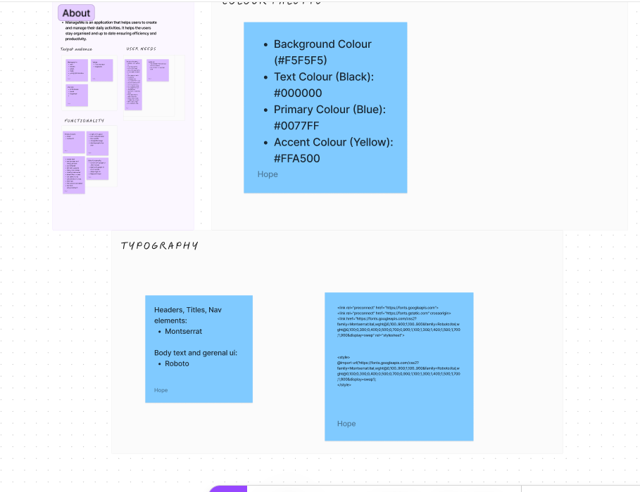
</details>

## Wireframes

Wireframes were developed using Balsamiq 
<details>
<summary>Create task</summary>

</details>

<details>
<summary>Created task</summary>

</details>

<details>
<summary>Home</summary>
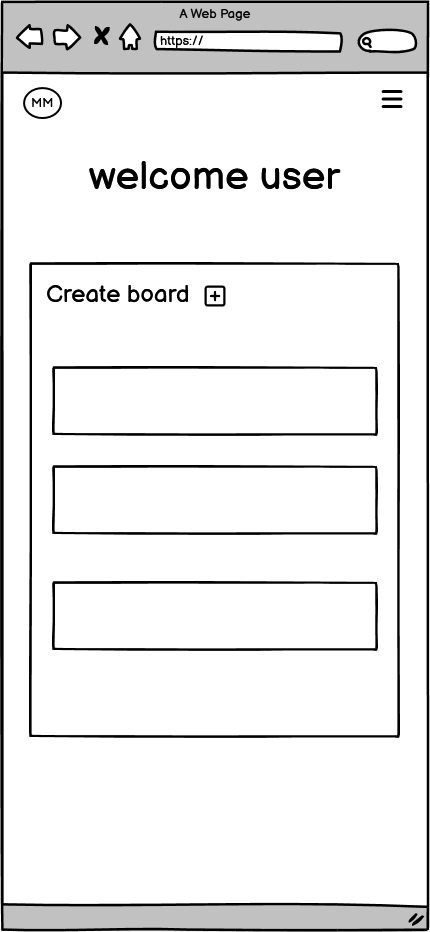
</details>

<details>
<summary>Landing page</summary>
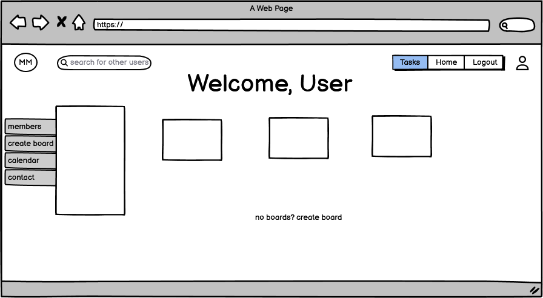
</details>

<details>
<summary>Login</summary>
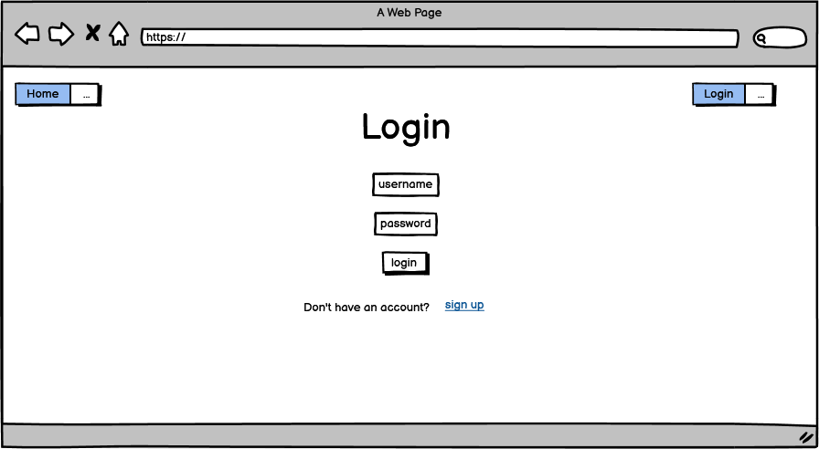
</details>

<details>
<summary>Signup</summary>
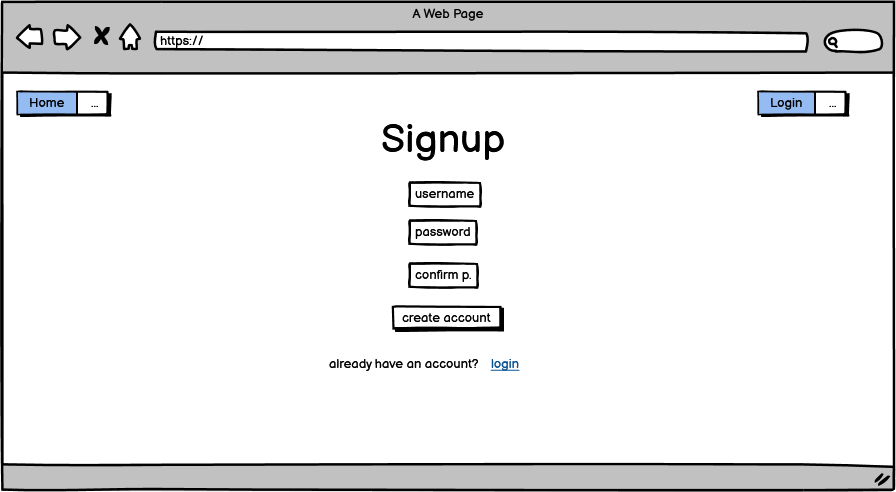
</details>

<details>
<summary>Start</summary>
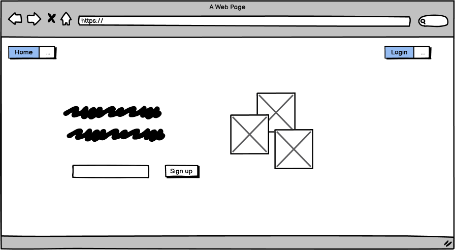
</details>

<details>
<summary>User Bio</summary>

</details>

<details>
<summary>User</summary>

</details>

<details>
<summary>Users</summary>
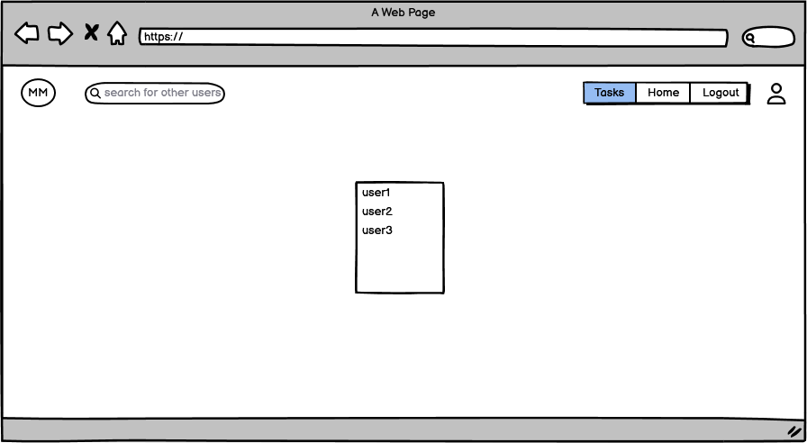
</details>


## Logic flow

Drawio was used to create the logic flow of the project, I can be found in my backend repo [here](https://github.com/Njorogetracy/managey_drf)

## Typography

Google fonts were implemented on the website, 'Montesserat and Robotto'

## Colour theme

<details>
<summary>The colour theme was developed using coolors</summary>

</details>

## Project management 

### Agile

- An Agile approach has been applied in the creation and planning of thi sapplication
- Github projects was used to manage this project's development cycles. 
- Github projects was usesd to track user stories and implement them based on the level of importance 
- The following categories were created:
    - Must have
    - Should have
    - Could have
- Due to the scope and time limit of this project, some features were not impelemented , and therefore will be implemeneted as future features
The link to the Github project is **[here](https://github.com/users/Njorogetracy/projects/7)**

### CRUD 

Data is handled with full CRUD functionality
- Create: Users are able to create profiles, tasks and comments
- Read: Users are able to view profiles, tasks and comments
- Update: Users are able to update profiles, tasks and comments
- Delete: Users are able to delete profiles, tasks and comments


# Features
<details>
<summary> Authentication </summary>
<summary> Users have to be authenticated before logging in to be able to access any functionality in the website.</summary>
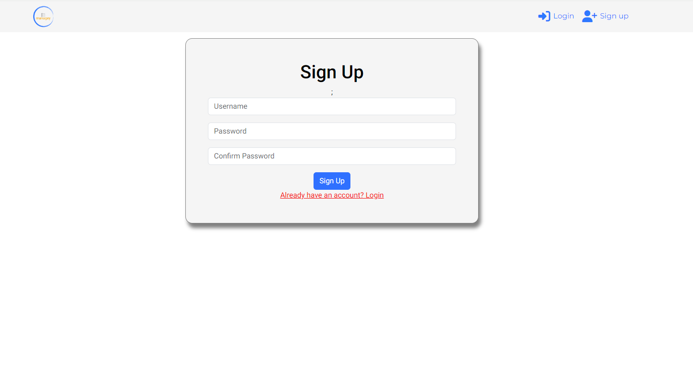
</details>

<details>
<summary>Login</summary>
<summary>This feature allow users to login and view content relevant to their profiles. Users require authentication in order to login</summary>
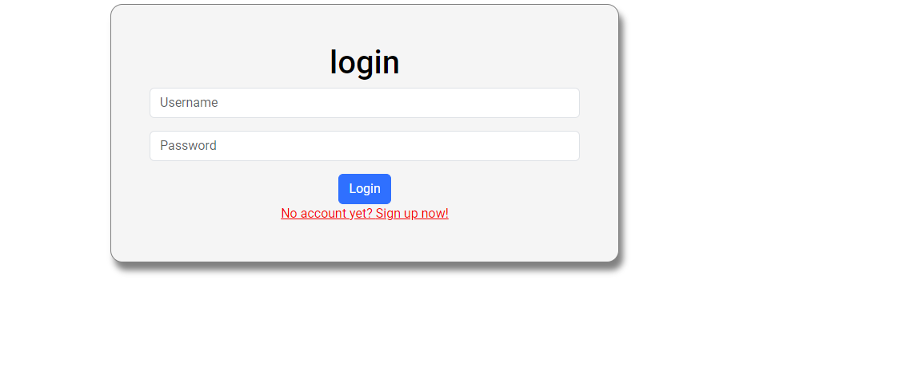
</details>

<details>
<summary>Sign Up</summary>
<summary>This feature allow new users to create an account</summary>

</details>

<details>
<summary>Home page</summary>
<summary>users view a list of tasks after successful login</summary>
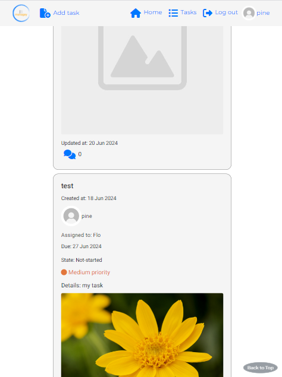
</details>

<details>
<summary>Navigation Bar</summary>
<summary>Loggedout view</summary>
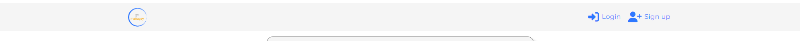
</details>

<details>
<summary>Profile</summary>
<summary>Use profile has user avatar, name and bio and list of tasks they created or are assigned to</summary>
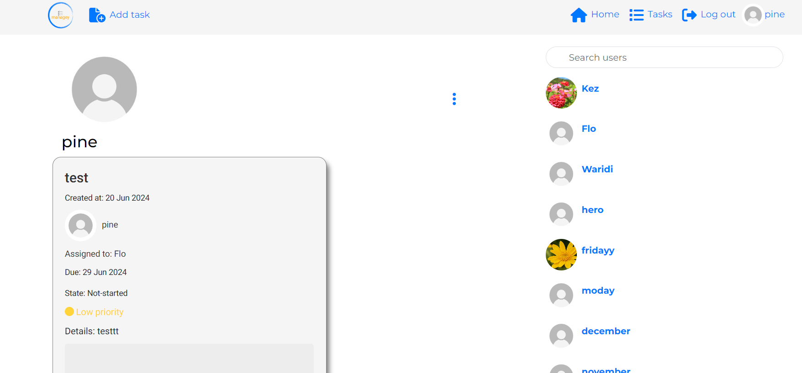
</details>

<details>
<summary>Add Task</summary>
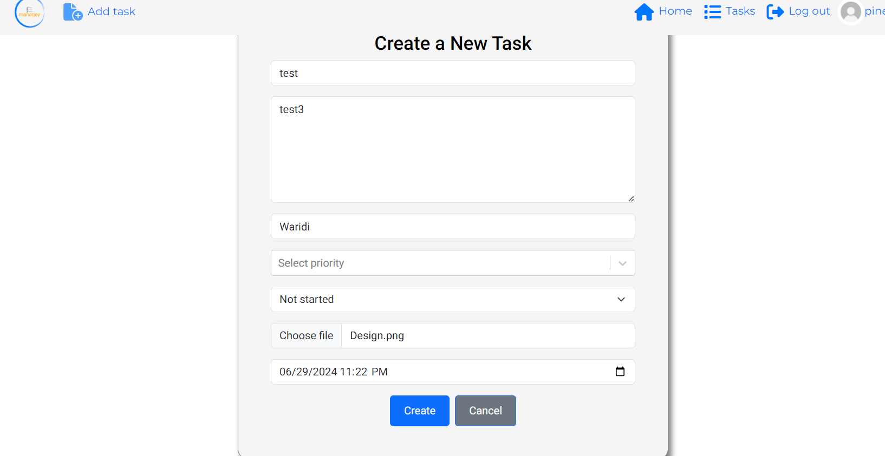
</details>

<details>
<summary>Edit Task</summary>
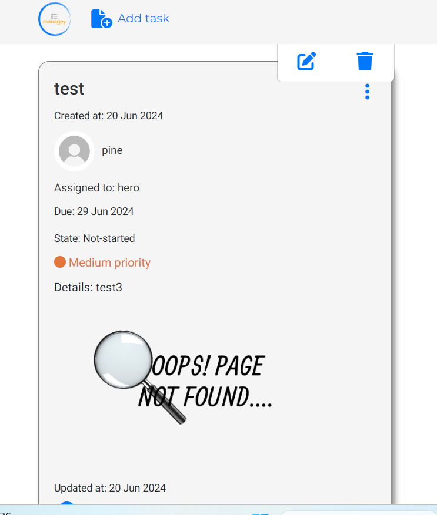
</details>

<details>
<summary>Delete Task</summary>
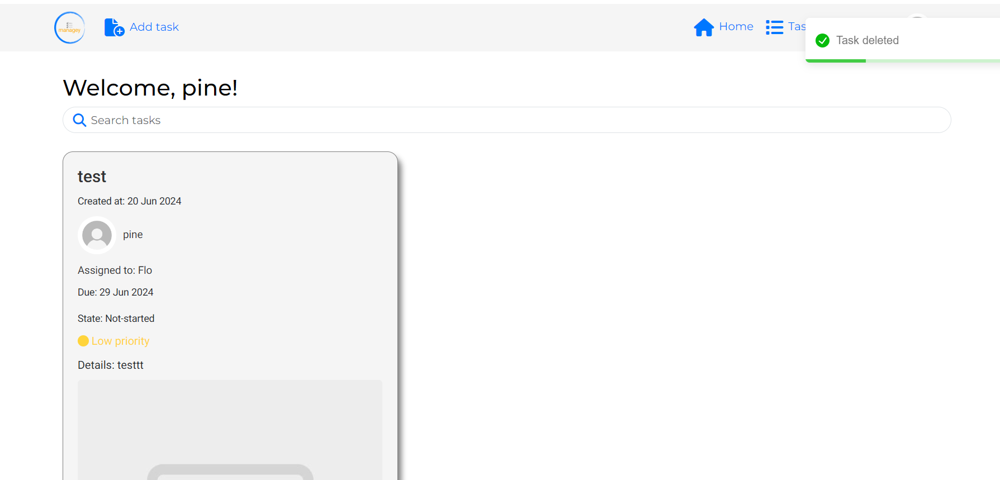
</details>

<details>
<summary>Create Task Comment</summary>
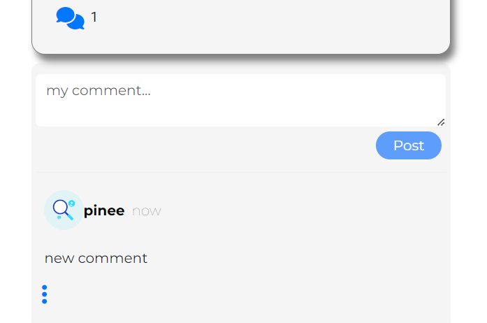
</details>

<details>
<summary>Edit Task Comment</summary>
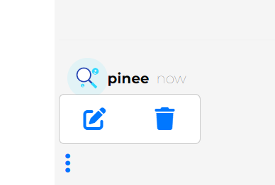
</details>

<details>
<summary>Delete Task Comment</summary>
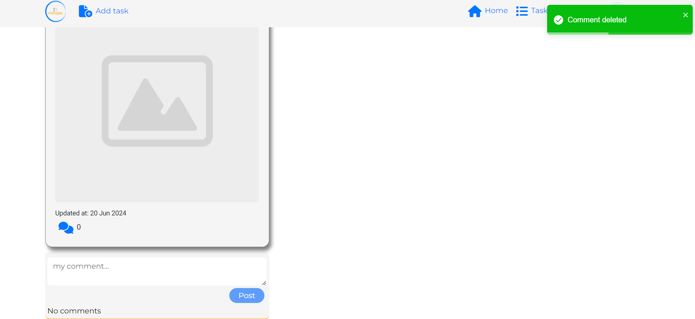
</details>

<details>
<summary>Profile Edit</summary>
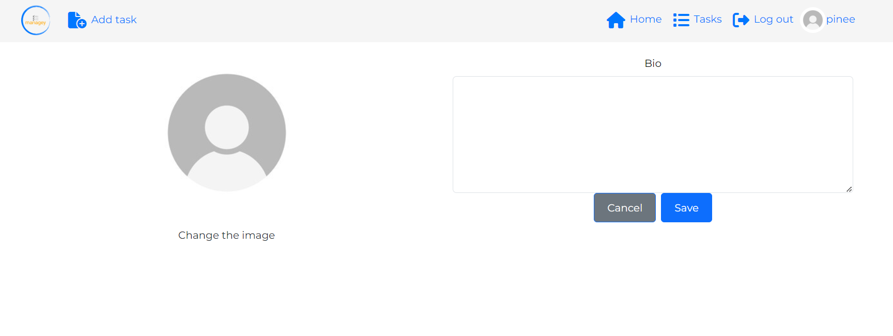
</details>

<details>
<summary>Edit username</summary>
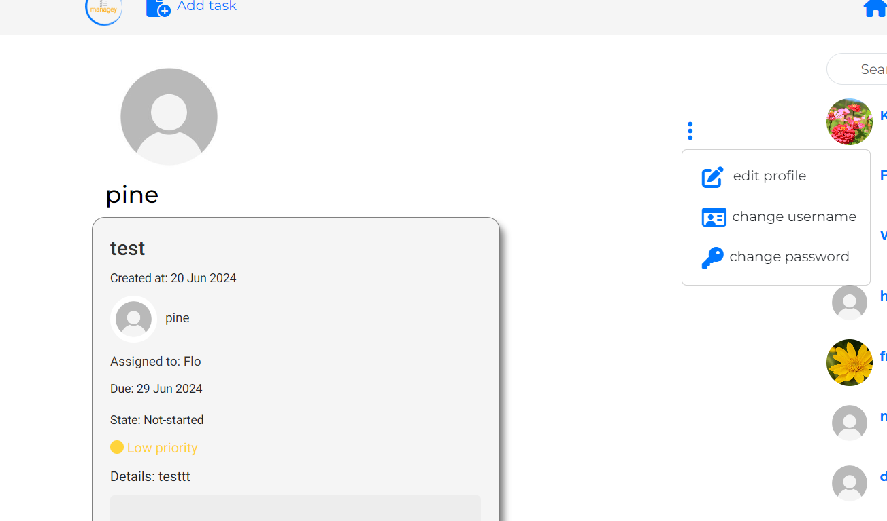
</details>

<details>
<summary>Username Form</summary>
<summary></summary>
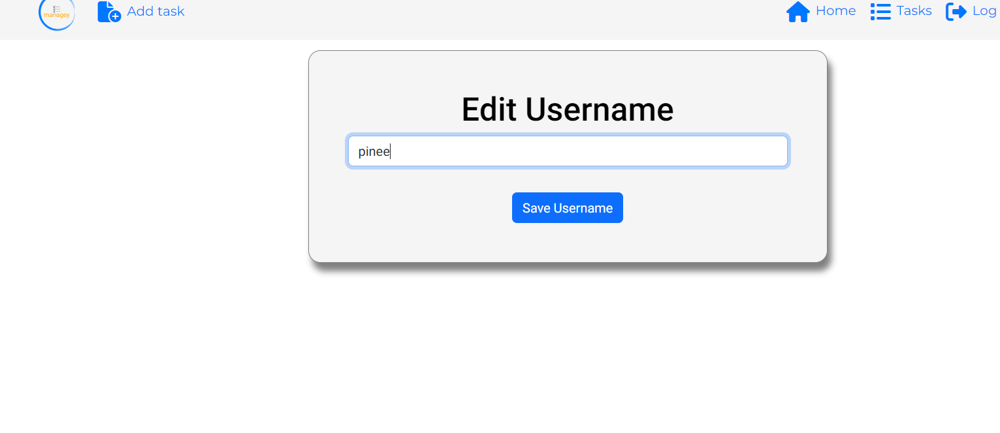
</details>

<details>
<summary>Change Username</summary>
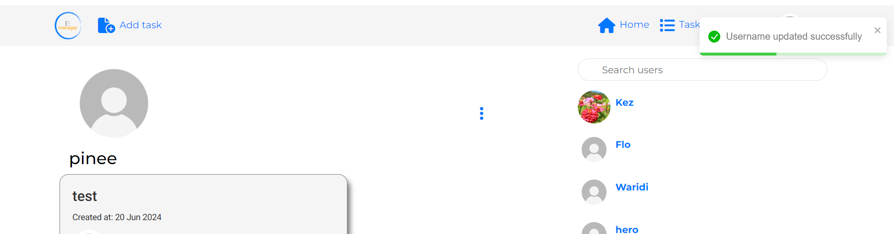
</details>

<details>
<summary></summary>
<summary></summary>

</details>


# Future Features
- Boards to display related user  tasks 
- Labels for tasks 
- Authenticated forgot password
- Collaborate on tasks 
- Display number of users on a task
- Task reminders
- Integration with google calendar API
- collaboration on tasks
- stats on task progress
- Add notifications

# Technologies Used

## Languages
- HTML
- CSS
- Javascript

## Frameworks and Tools
- Bootstrap: A front-end framework for developing responsive and mobile-first websites.
- react-bootstrap: Integration of Bootstrap with React, offering Bootstrap components as React components.

## Libraries and packages
- React: This library is used for building the user interface components 
- Axios: A Promise-based HTTP client for making HTTP requests from node.js or XMLHttpRequests from the browser
- React-Toastify: A package used to add notifications 
- React-Select: A Select control for React
- React Router: Javascript framework for routing
- React Infinite Scroll: React library to load components on the page
- React scripts
- React dom
- jwt-decode

## Other programs and libraries
- Google Fonts - for the font family.
- Font Awesome - to add icons throughout the site.
- GitPod - to creat my html files & styling sheet before pushing the project to Github.
- Visual Studio - For all Development work
- Favicon - to provide the code & image for the icon in the tab bar.
- Balsamiq Wireframe - to create Wireframes for the site layout.
- Cloudinary - used to host static and media files
- ElephantSQL - used to host postgres database used in the project
- Figma - Used to brainstorm the prooject ideas
- Github - Hosting snf version control 
- Microsoft Designer - create background images
- ESLint - JS validation
- Lighthouse - Performance validattion
- Wave - Accessibility editor

# Front-End
## React
### Components:
There are various components that have been used throughout this application:
- ```<NavBar/>``` This is a reusable component, used for navigation on the site. This component is used to display different icons based on users loggedin/out status. If a user is not logged in, they can see the home, login and sigup icons. However, if they are logged in they are able to see more icons except the login and signup.
- ```<NotFound/>``` This is a component that displays a 404 error when the user clicks a button to a page that does not exist.
- ```<Avatar/>``` This is a reusable component used to display the users' profile picture.
- ```<DropDown />``` esuable component, used to display the three dots option button to display edit and delete

### pages:
* Auth which has the following files:
    - SignUpForm.js - Handles user account creation 
    - LoginForm.js - Handles user login


# Backend API
The API for this frontend was built using Django Rest Framework. See the repository [here](https://github.com/Njorogetracy/managey_drf)


# Testing
## View Test.md

<details>
<summary></summary>
<summary></summary>

</details>

<details>
<summary></summary>
<summary></summary>

</details>

<details>
<summary></summary>
<summary></summary>

</details>


# Deployment
The Site was deployed using Heroku Hosting Platform.

## React Deployment 
- Add a Procfile to the root of the project with the following content: web: serve -s build
- Add your deployed API URL to the axios requests in the project
- Run npm run build to create a production build of the project

## Heroku Deployment 
- Create a new project on Heroku
- Connect Github Repo
- In settings, configure Environment Variables lilke Database URL, Cloudinary URL etc..
- In Deploy, configure your automatic deploys or not.
- Deploy App

# Credits
## Code Used and Content
- [Implementing a page not found](https://www.geeksforgeeks.org/how-to-setup-404-page-in-react-routing/)
- [mapping over an array of objects](https://developer.mozilla.org/en-US/docs/Web/JavaScript/Reference/Global_Objects/Array/from)
- [mapping over children](https://react.dev/reference/react/Children#children-map)
- [React Router v6 Preview](https://reacttraining.com/blog/react-router-v6-pre)
- [React useNavigate hook](https://www.geeksforgeeks.org/replacement-of-usehistory-hook-in-react/)
- [UseNavigate hook](https://stackoverflow.com/questions/31079081/how-to-programmatically-navigate-using-react-router)
- [Float nav items right](https://stackoverflow.com/questions/42311292/react-bootstrap-navbar-how-to-right-align-a-navbar-item)
- [React Select styles](https://react-select.com/styles#the-styles-prop)
- [Create app logo](https://logo.com/login?returnTo=%2Fdashboard%2Fyour-logo-files)
- [Proptypes issue](https://github.com/jsx-eslint/eslint-plugin-react/issues/498)
- [Eslint configuration](https://github.com/jsx-eslint/eslint-plugin-react#configuration)

# Acknowledgements

## [Back To Top](#table-of-contents)