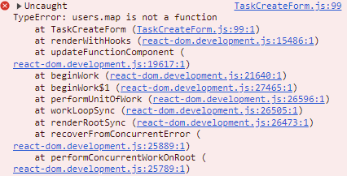
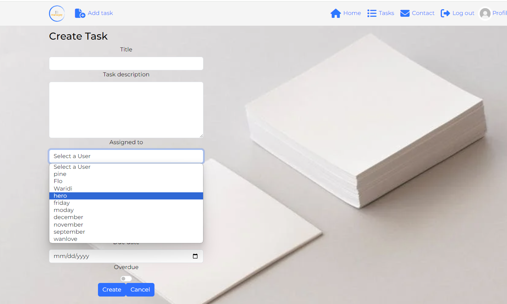

# Managey - Project Portfolio 5 - Advanvced Frontend (React)

Managey is an application that enables to organize activities in order to promotee productivity and effeciency. In its current iteration, users can create, view, edit, search, filter and delete tasks. A user can view their tasks as well as tasks assigned to them. Users are also able t comment on tasks in order to followup, ellaborate or find out more about a task. 

You can view the live site here:
You can view the API here:
You can view the API repository here:

# Table of Contents

# [User Experince](#user-experince)
* [Project goals](#project-goals)
* [User Stories](#user-stories)
* [Wireframes](#wireframes)
* [Logic flow](#logic-flow)
* [Typography](#typography)
* [Color Theme](#color-theme)
* [Project management](#project-management)
# [Permissions](#permissions)
* [Logged out User](#logged-out-user)
* [Logged in User](#logged-in-user)
# [Features](#features)
# [Future Features](#future-features)
# [Technologies Used](#technologies-used)
* [Lanaguages](#languages)
* [Frameworks and Tools](#frameworks-and-tools)
* [Libraries](#libraries)
# [Front-End](#front-end)
* [React](#react)
# [Backend API](#backend-api)
* [Django REST Framework](#django-rest-framework)
# [Validation](#validation)
* [HTML](#html)
* [CSS](#css)
* [ESLint Javascript JSX Validation](#eslint-javascript-jsx-validation)
* [Lighthouse](#lighthouse)
* [WAVE](#wave)
# [Testing](#testing)
* [Device-testing](#device-testing)
* [Browser-compatibility](#browser-compatibility)
* [Manual-testing](#manual-testing)
# [Bug Fixes](#bug-fixes)
# [Deployment](#deployment)
* [Heroku](#heroku)
* [Forking](#forking)
* [Cloning](#cloning)
# [Credits](#credits)
* [Code Used](#code-used)
* [Content](#content)
# [Acknowledgements](#acknowledgements)


# User Experince

## Project goals 

## User Stories

| **EPIC** | **User Story** |
|----------|-----------------|
| Authentication | As a user, I want to signup/create an account so as to access the application and its features |
|  | As a user, I want to signin so I access the app and its funtionality as a logged in use |
| | As a user, I can see if I am logged in or not |
|  | As a user, I want to maintain logged in status until I logout |
| Navigation | As a user I want to view the navigation bar so I can navigate with ease between different pages |
|  | As a user, i want to navigate easily through the pages |
| |  As a logged out user, I can see sign-in/sign-up options in the navigation bar |

## Strategy

<details>
<summary></summary>

</details>

## Wireframes

Wireframes were developed using Balsamiq 
<details>
<summary></summary>

</details>

## Logic flow

Drawio was used to create the logic flow of the project

## Typography

Google fonts were implemented on the website, 'Montesserat and Robotto'

## Colour theme

The colour theme was developed using **coolors**
<details>
<summary></summary>

</details>

## Project management 

### Agile

- An Agile approach has been applied in the creation and planning of thi sapplication
- Github projects was used to manage this project's development cycles. 
- Github projects was usesd to track user stories and implement them based on the level of importance 
- The following categories were created:
    - Must have
    - Should have
    - Could have
- Due to the scope and time limit of this project, some features were not impelemented , and therefore will be implemeneted as future features
The link to the Github project is **[here](https://github.com/users/Njorogetracy/projects/7)**

### CRUD 

Data is handled with full CRUD functionality
- Create: Users are able to create profiles, tasks and comments
- Read: Users are able to view profiles, tasks and comments
- Update: Users are able to update profiles, tasks and comments
- Delete: Users are able to delete profiles, tasks and comments


# Permissions


# Features
<details>
<summary> Authentication </summary>
<summary> Users have to be authenticated before logging in to be able to access any functionality in the website.</summary>

</details>

<details>
<summary>Login</summary>
<summary>This feature allow users to login and view content relevant to their profiles. Users require authentication in order to login</summary>

</details>

<details>
<summary>Sign Up</summary>
<summary>This feature allow new users to create an account</summary>

</details>

<details>
<summary>Home page</summary>
<summary></summary>

</details>

<details>
<summary>Navigation Bar</summary>
<summary></summary>

</details>

<details>
<summary>Profile</summary>
<summary></summary>

</details>

<details>
<summary>Add Task</summary>
<summary></summary>

</details>

<details>
<summary>Edit Task</summary>
<summary></summary>

</details>

<details>
<summary>Delete Task</summary>
<summary></summary>

</details>

<details>
<summary>Create Task Comment</summary>
<summary></summary>

</details>

<details>
<summary>Edit Task Comment</summary>
<summary></summary>

</details>

<details>
<summary>Delete Task Comment</summary>
<summary></summary>

</details>

<details>
<summary></summary>
<summary></summary>

</details>

<details>
<summary></summary>
<summary></summary>

</details>

<details>
<summary></summary>
<summary></summary>

</details>

<details>
<summary></summary>
<summary></summary>

</details>

<details>
<summary></summary>
<summary></summary>

</details>


# Future Features
- Boards to display related user  tasks 
- Labels for tasks 
- Authenticated forgot password
- Collaborate on tasks 
- Displau number of users on a task
- Task reminders
- Integration with google calendar API

# Technologies Used

## Languages
- HTML
- CSS
- Javascript

## Frameworks and Tools
- Bootstrap: A front-end framework for developing responsive and mobile-first websites.
- react-bootstrap: Integration of Bootstrap with React, offering Bootstrap components as React components.

## Libraries
- React: This library is used for building the user interface components 
- Axios: A Promise-based HTTP client for making HTTP requests from node.js or XMLHttpRequests from the browser

## Other programs and libraries
- Google Fonts - for the font family.
- Font Awesome - to add icons throughout the site.
- GitPod - to creat my html files & styling sheet before pushing the project to Github.
- Visual Studio - For all Development work
- Favicon - to provide the code & image for the icon in the tab bar.
- Balsamiq Wireframe - to create Wireframes for the site layout.
- Cloudinary - used to host static and media files
- ElephantSQL - used to host postgres database used in proje

# Front-End
## React
### Components:
There are various components that have been used throughout this application:
- ```<NavBar/>``` This is a reusable component, used for navigation on the site. This component is used to display different icons based on users loggedin/out status. If a user is not logged in, they can see the home, login and sigup icons. However, if they are logged in they are able to see more icons except the login and signup.
- ```<NotFound/>``` This is a component that displays a 404 error when the user clicks a button to a page that does not exist.
- ```<Avatar/>``` This is a reusable component used to display the users' profile picture.

### pages:
* Auth which has the following files:
    - SignUpForm.js - Handles user account creation 
    - LoginForm.js - Handles user login


# Backend API
The API for this frontend was built using Django Rest Framework. See the repository [here](https://github.com/Njorogetracy/managey_drf)


# Testing

# Bug Fixes
<details>
<summary> Import Error </summary>
<summary>
Switch model is not exported from react-router-dom error. I used the Switch model in and got an error. This error was resolved by importing "Routes". react v6 changed the names from "switch" to "routes"
</summary>

</details>

<details>
<summary>login Error</summary>
<summary>405 error, while trying to login. The error was due to an authentication request instead of a login request to the api, ```axios.post(dj-rest-auth/registration)```. I resolved the error by sending a login request ```axios.post(dj-rest-auth/login)``` </summary>


</details>

<details>
<summary></summary>
<summary></summary>

</details>

<details>
<summary></summary>
<summary></summary>

</details>

<details>
<summary></summary>
<summary></summary>

</details>

<details>
<summary>map error</summary>
<summary>this error occurred while trying to map over the array of profiles returned from the api request. My handleChangeUser function, was setting `users` as an object rather than an array. The function was updating the users instead of the assigned_users. To resolves this,I added a new state `aasignedUsers` to keep track of the selected user. Inside the handleChange function, the selectedOptions variable, converts the data into an array and returns a list of the <options> element currently selected in the dropdownlist and the setAssignedUsers updates the assignedusers state with the new array of userIDs</summary>


</details>


# Deployment
The Site was deployed using Heroku Hosting Platform.

## React Deployment 
- Add a Procfile to the root of the project with the following content: web: serve -s build
- Add your deployed API URL to the axios requests in the project
- Run npm run build to create a production build of the project

## Heroku Deployment 
- Create a new project on Heroku
- Connect Github Repo
- In settings, configure Environment Variables lilke Database URL, Cloudinary URL etc..
- In Deploy, configure your automatic deploys or not.
- Deploy App

# Credits
## Code Used
- [Implementing a page not found](https://www.geeksforgeeks.org/how-to-setup-404-page-in-react-routing/)
- [mapping over an array of objects](https://developer.mozilla.org/en-US/docs/Web/JavaScript/Reference/Global_Objects/Array/from)
- [mapping over children](https://react.dev/reference/react/Children#children-map)
- [React Router v6 Preview](https://reacttraining.com/blog/react-router-v6-pre)
- [React useNavigate hook](https://www.geeksforgeeks.org/replacement-of-usehistory-hook-in-react/)
- [UseNavigate hook](https://stackoverflow.com/questions/31079081/how-to-programmatically-navigate-using-react-router)
- [Float nav items right](https://stackoverflow.com/questions/42311292/react-bootstrap-navbar-how-to-right-align-a-navbar-item)

# Acknowledgements

## [Back To Top](#table-of-contents)