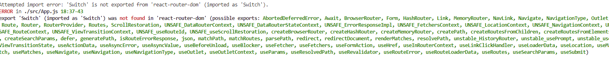
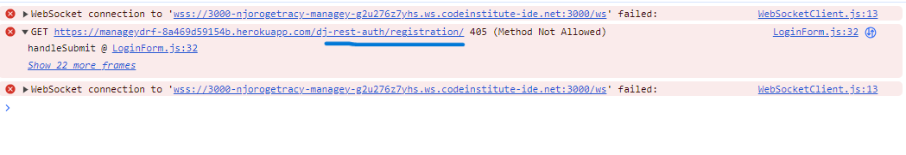
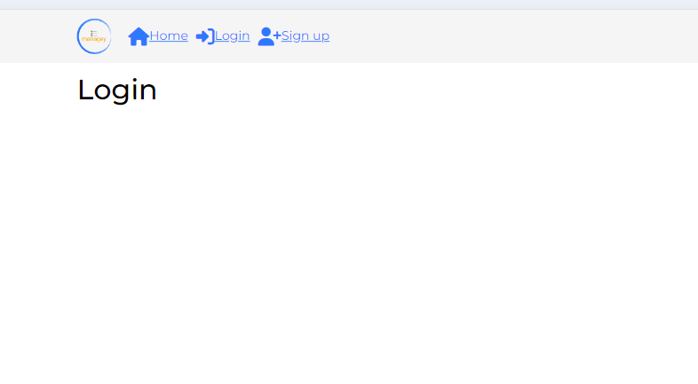
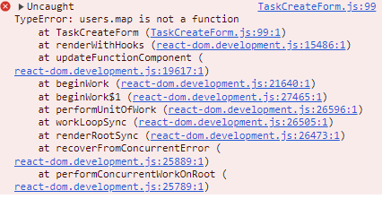
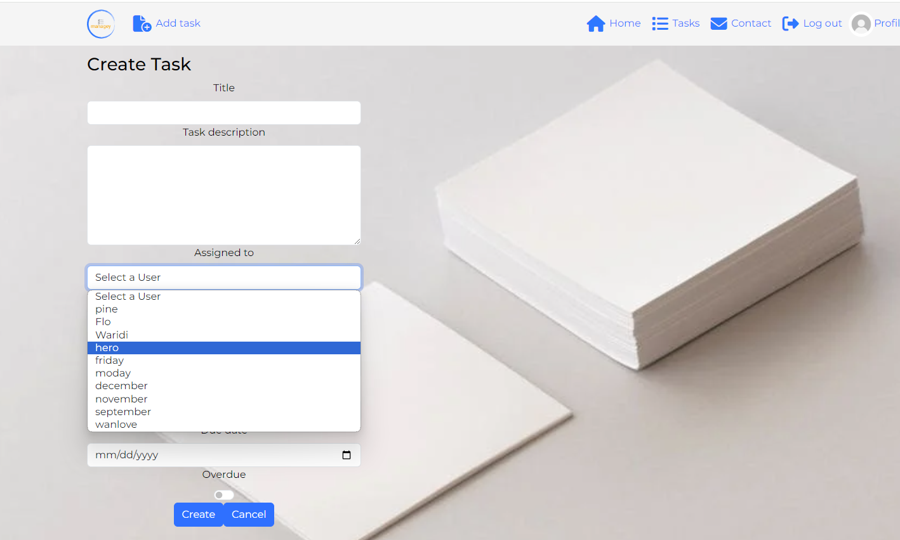
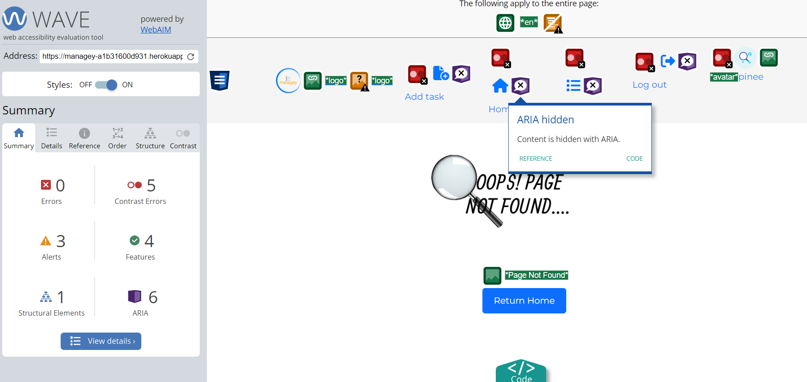

ALL Tests conducted in the website can be founf here:

# Table of Content

# [Testing](#testing)
* [Device-testing](#device-testing)
* [Browser-compatibility](#browser-compatibility)
* [Manual-testing](#manual-testing)
# [Bug Fixes](#bug-fixes)


# Manual Testing
**1\. Authentication (auth)**

**Signup/Login/Logout Buttons**

- **Element:** Signup Button
  - **Expected** - Clicking Signup button should navigate user to the signup form.
  - **Testing** - Clicked on Signup button.
  - **Result** - User navigated to the signup form as expected.  a user can signup and thereafter redirected to login page
  - **Fix** - No issues found.
- **Element:** Login Button
  - **Expected** - Clicking Login button should navigate user to the login form.
  - **Testing** - Clicked on Login button.
  - **Result** - User navigated to the login form as expected.
  - **Bug** - After deployment, The user is successfully logged in but the unsuccessfull notification appears
  - **Unresolved** - Not yest resolved
- **Element:** Logout Button
  - **Expected** - Clicking Logout button should log out the current user.
  - **Testing** - Logged in user and clicked Logout button.
  - **Result** - User was successfully logged out.
  - **Fix** - No issues found.

**2\. Navigation Elements**

- **Element:** Home Link
  - **Expected** - Clicking on the Home link should navigate user to the home page.
  - **Testing** - Clicked on Home link
  - **Result** - User navigated to a lists of tasks on their homepage as expected.
  - **Fix** - No issues found.
- **Element:** Tasks Link
  - **Expected** - "Clicking on Tasks link should navigate user to all their tasks."
  - **Testing** - Clicked on Tasks link.
  - **Result** - User navigated to a lists of tasks and a search icon section as expected.
  - **Fix** - No issues found.
- **Element:** Profile Avatar
  - **Expected** - "Clicking on the profile avatar should navigate user to their profile page."
  - **Testing** - Clicked on the profile avatar.
  - **Result** - User navigated to their profile page as expected.
  - **Fix** - No issues found.

**3\. Tasks**

**Task Management**

- **Element:** Task List (All created tasks)
  - **Expected** - All created tasks should be listed for the user.
  - **Testing** - Verified presence of all created tasks in the task list.
  - **Result** - All created tasks were displayed correctly.
  - **Fix** - No issues found.
- **Element:** Add Task Button
  - **Expected** - Clicking Add Task button should open the task creation form.
  - **Testing** - Clicked on Add Task button.
  - **Result** - Task creation form opened successfully.
  - **Fix** - No issues found.
  -**Element:** Submit Create Task Button
  - **Expected** - Clicking Add Task button should submit a form, shoe success message and redirect to tasklists.
  - **Testing** - Clicked on  button.
  - **Result** - Task form submitted successfully.
  - **Fix** - No issues found.
- **Element:** Cancel Task Create Button
  - **Expected** - Clicking Cancel button in task creation form should close the form without saving.
  - **Testing** - Filled task creation form and clicked Cancel button.
  - **Result** - Task creation form closed without saving as expected.
  - **Fix** - No issues found.
- **Element:** Edit Task Button
  - **Expected** - Clicking Edit button on a task should open the task editing form.
  - **Testing** - Clicked Edit button on a task.
  - **Result** - Task editing form opened with some task details filled correctly.
  - **Bug** - The task does not fetch assigned user
  - **Fix** - Not yet resolved.
- **Element:** Delete Task Button
  - **Expected** - Clicking Delete button on a task should delete the task.
  - **Testing** - Clicked Delete button on a task.
  - **Result** - Task was deleted successfully.
  - **Fix** - No issues found.

**Task Form**

- **Element:** Create Task Form
  - **Expected** - User should be able to fill all fields (Title, Description, User Assign, Priority, State, Date) and submit the form.
  - **Testing** - Filled all fields and submitted the form.
  - **Result** - Form submitted successfully with all data saved.
  - **Fix** - No issues found.

 - **Element:** Create Task Form
  - **Expected** - User should not be able to submit an empty form.
  - **Testing** - Click submit button while file is empty.
  - **Result** - Validation error displayed to user.
  - **Fix** - No issues found. 

- **Element:** Create Task Form
  - **Expected** - User should not be able to choose past date.
  - **Testing** - Click submit button while file is empty.
  - **Bug** - User could choose past date
  - **Fix** - Added validation to the backend task serialiser and a condition to the frontend
  - **Result** - Solved, user cannot pick past days.

- **Element:** Create Task Form
  - **Expected** - User should assign task to user.
  - **Testing** - Users should choose an assignee.
  - **Bug** - No Users were displayed in the dropdown list
  - **Fix** - Added function to map ove users and return each individual user
  - **Result** - Solved, user can choose an assignee.


**4\. Comments**

**Comment Management**

- **Element:** Create Comment
  - **Expected** - User should be able to create a comment on a task.
  - **Testing** - Created a new comment on a task.
  - **Result** - Comment was created and displayed correctly.
  - **Fix** - No issues found.
- **Element:** Edit Comment
  - **Expected** - User should be able to edit their own comment.
  - **Testing** - Edited an existing comment.
  - **Result** - Comment was edited and updated correctly.
  - **Fix** - No issues found.
- **Element:** Delete Comment
  - **Expected** - User should be able to delete their own comment.
  - **Testing** - Deleted an existing comment.
  - **Result** - Comment was deleted successfully.
  - **Fix** - No issues found.

  **Comment_count**
- **Element:** Comment count
  - **Expected** - Comment count should update each time comment is added
  - **Testing** - add comment and submit
  - **Bugs** - Comment count updates but returns a Nan value or ressets on a page that has previous comments.
  - **Result** - Comment was deleted successfully.
  - **Fix** - No issues found.

**5\. User Profile**

**Profile Management**

- **Element:** View Tasks (Own and Assigned)
  - **Expected** - User should be able to view tasks assigned to them and tasks they have assigned to others.
  - **Testing** - Checked tasks section in user profile.
  - **Bug** - User could not see assigned tasks. User could also see their tasks on other users' profile
  - **Fix** - Added condition so user can only see their tasks.
  - **Result** - All relevant tasks were displayed correctly.
- **Element:** Click Other User's Avatar
  - **Expected** - User should be able to click on another user's avatar to view their profile details and tasks assigned to them by the viewing user.
  - **Testing** - Clicked on another user's avatar.
  - **Bugs** - User could see all tasks including those tha have not been assigned ny them
  - **Fix** - Solved
  - **Result** - Other user's profile details (name, bio, assigned tasks) were displayed correctly. assigned tasks only display if the logged in user has assigned that task
- **Element:** Update Username/Avatar/Password
  - **Expected** - User should be able to update their username, avatar image, and password.
  - **Testing** - Updated username, avatar image, and password.
  - **Result** - Changes were saved and reflected correctly in the user profile.
  - **Fix** - No issues found.
- **Element:** Update Avatar/Bio
  - **Expected** - User should be able to update their username and bio
  - **Testing** - Click edit profile
  - **Bug** - Changes are saved but avatar disappears when tryping bio
  - **Result** - avatar is updated and bio is also updated
  - **Fix** - Unresolved bug.


# ESLint 
<details>
<summary>Running ESLint resulted in displaying errors in my build page and react/prop-types [PROP_NAME] is missing in props validation </summary>
<summary> This is an issue with ESLint and it has been documented [here](https://github.com/jsx-eslint/eslint-plugin-react/issues/498) </summary>
</details>


# Bug Fixes
<details>
<summary> Import Error </summary>
<summary>
Switch model is not exported from react-router-dom error. I used the Switch model in and got an error. This error was resolved by importing "Routes". react v6 changed the names from "switch" to "routes"
</summary>

</details>

<details>
<summary>login Error</summary>
<summary>405 error, while trying to login. The error was due to an authentication request instead of a login request to the api, ```axios.post(dj-rest-auth/registration)```. I resolved the error by sending a login request ```axios.post(dj-rest-auth/login)``` </summary>


</details>

<details>
<summary>This error occured while tring to login after creating an account since it was making a request to the wrong API endpoint, the error was solved by adjusting the URL on the axios request</summary>

</details>

<details>
<summary>map error</summary>
<summary>this error occurred while trying to map over the array of profiles returned from the api request. My handleChangeUser function, was setting `users` as an object rather than an array. The function was updating the users instead of the assigned_users. To resolves this,I added a new state `aasignedUsers` to keep track of the selected user. Inside the handleChange function, the selectedOptions variable, converts the data into an array and returns a list of the <options> element currently selected in the dropdownlist and the setAssignedUsers updates the assignedusers state with the new array of userIDs</summary>


</details>

# Validation:
<details>
<summary></summary>

</details>